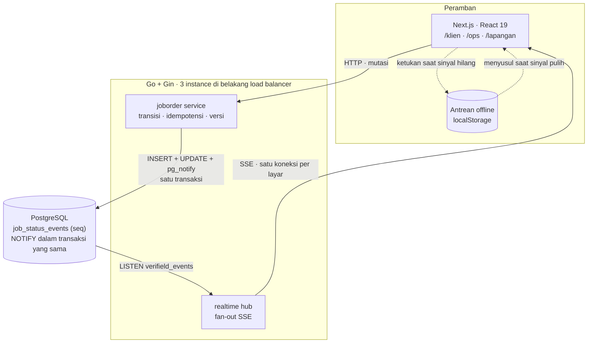
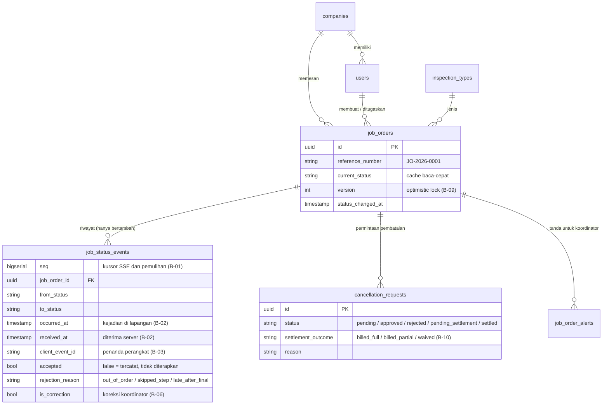
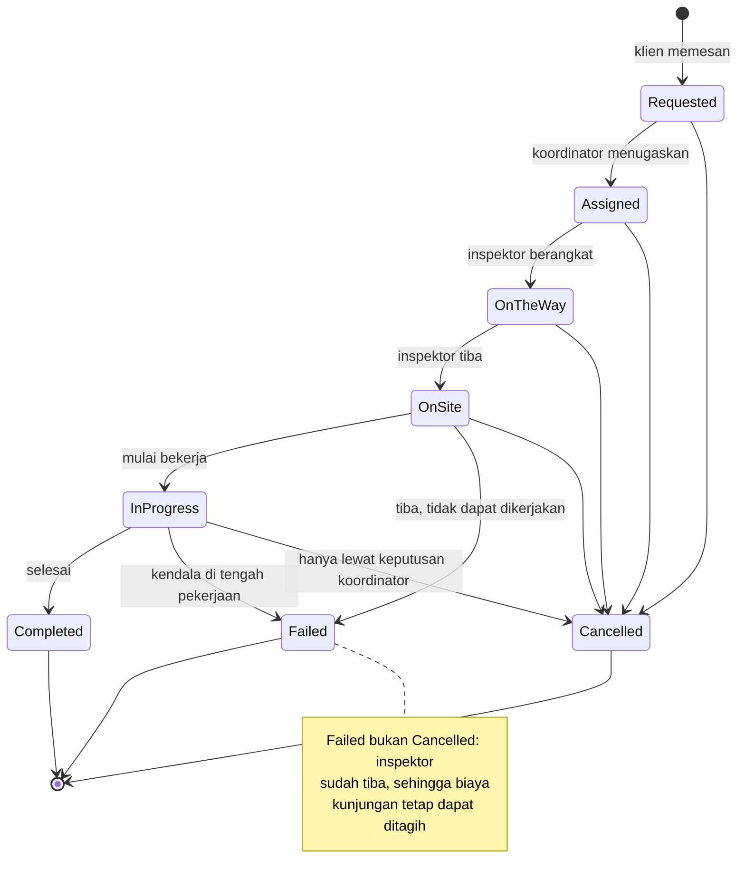
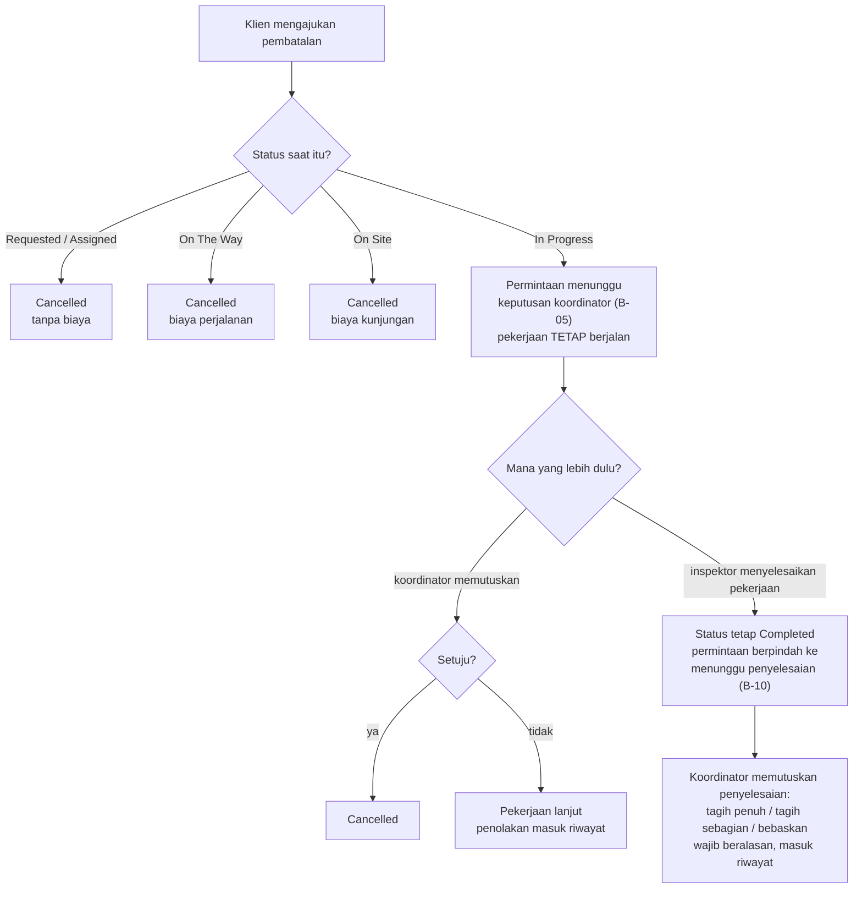

# Verifield — Deliverable A: Dokumen Ringkas

**Technical Assignment — Fullstack Developer · Case Study 1: Real-Time Order & Job Tracking**

Dokumen ini berdiri sendiri sebagai Deliverable A. Analisis lengkap dengan nomor keputusan
(B-01…B-12, A-01…A-08) ada di [01-business-context.md](01-business-context.md); rincian
teknis dan bukti implementasi ada di [02-technical-design.md](02-technical-design.md).

---

**Peta baca.** Bagian 0 memuat seluruh gagasannya dalam satu menit. Bagian 1–3 dan 7
adalah inti — pemahaman masalah, asumsi, batas cakupan, dan edge case. Bagian 4–6 adalah
gambar. Sisanya rincian yang boleh dilewati sampai dibutuhkan.

---

## 0. Ringkasan Eksekutif

Untuk pembaca yang hanya punya satu menit.

Customer Service menghabiskan hari untuk menjawab satu pertanyaan: *"pekerjaan saya
sudah sampai mana?"* Penyebabnya bukan klien yang tidak sabar, melainkan **status
pekerjaan yang hanya ada di kepala inspektor, tidak di dalam sistem**. CS adalah
jembatan manual antara lapangan dan klien.

Karena itu halaman pelacakan saja tidak akan menyelesaikan apa pun. Kalau inspektor
tidak memperbarui status, klien justru menelepon lebih sering — sekarang ia punya bukti
bahwa statusnya diam tiga jam. Maka yang dibangun ada dua sisi sekaligus:

| Untuk siapa | Yang ia dapat | Mengapa itu yang dipilih |
|---|---|---|
| **Klien** | Status berubah sendiri di layar, tanpa menekan apa pun, lengkap dengan riwayat waktunya | Menghapus alasan menelepon, bukan sekadar memindahkan informasinya |
| **Inspektor** | Satu tombol besar berisi langkah berikutnya; tetap bekerja tanpa sinyal; ditekan berkali-kali tetap aman | Kalau memperbarui status itu merepotkan, ia tidak akan dilakukan — dan seluruh sistem ikut gagal |
| **Koordinator** | Satu layar berisi order yang butuh disentuh manusia, bukan seluruh order | Perhatian manusia adalah sumber daya paling mahal di ruangan itu |

Satu keputusan yang paling menentukan: **riwayat status disimpan sebagai kejadian yang
hanya bertambah, tidak pernah ditimpa.** Hasil inspeksi menjadi dasar sertifikat, klaim
asuransi, dan pelepasan pembayaran — pertanyaan "kapan inspektor tiba" harus tetap bisa
dijawab setahun kemudian. Bentuk itu juga yang membuat tiga hal lain menjadi mungkin
sekaligus: mengirim ulang perubahan yang terlewat, menolak laporan yang datang terbalik
urutannya, dan menjelaskan kepada siapa pun mengapa statusnya begitu.

**Ukuran keberhasilannya** bukan jumlah fitur, melainkan: berkurangnya panggilan yang
menanyakan status, dan naiknya proporsi pekerjaan yang statusnya diperbarui inspektor
kurang dari 15 menit sejak kejadian sebenarnya.

Selebihnya dokumen ini menjelaskan asumsi, batasan, dan alasan di balik tiap keputusan.

---

## 1. Problem Understanding

Gejalanya: tim Customer Service menghabiskan sebagian besar waktunya menjawab satu
pertanyaan yang sama berulang kali — *"pekerjaan saya sudah sampai mana?"*

Rumusan dangkalnya adalah *"klien tidak bisa melihat status pekerjaannya"*. Rumusan
tersebut kurang tepat, dan solusinya akan salah sasaran. **Akar masalah sebenarnya:
status pekerjaan hidup di kepala inspektor, bukan di dalam sistem.** CS berfungsi
sebagai jembatan manual antara lapangan dan klien — satu pertanyaan klien memicu dua
sampai tiga interaksi.

Konsekuensi pentingnya: membangun halaman tracking **tidak akan menyelesaikan masalah**
apabila inspektor tidak memperbarui status secara disiplin. Jika data di layar basi,
klien tetap menelepon CS — bahkan berpotensi lebih sering, karena kini mereka punya
bukti konkret bahwa status tidak berubah selama tiga jam.

Maka masalah ini memiliki dua sisi yang harus ditangani bersamaan:

1. **Sisi klien** — visibilitas status yang dapat dipercaya, tanpa perantara, tanpa refresh.
2. **Sisi inspektor** — cara memperbarui status yang biayanya sangat murah: satu ketukan
   kontekstual, tetap bekerja saat sinyal hilang, dan tidak menghukum ketukan berulang.

Sisi kedua inilah yang menentukan keberhasilan sistem, dan paling sering diabaikan.

**Ukuran keberhasilan:** (1) penurunan panggilan bertanya status; (2) proporsi job order
yang statusnya diperbarui inspektor dalam waktu kurang dari 15 menit sejak kejadian sebenarnya.

---

## 2. Assumptions

| Kode | Asumsi | Alasan |
|---|---|---|
| A-01 | Satu job order ditangani satu inspektor | Menghindari status gabungan dan wewenang ganda |
| A-02 | Satu order terikat satu klien dan satu lokasi | Sesuai praktik penagihan per penugasan |
| A-03 | Klien hanya melihat order milik perusahaannya | Kerahasiaan komersial antar klien |
| A-04 | Operasi berlangsung dalam satu zona waktu | Menyederhanakan penanganan waktu |
| A-05 | Perangkat inspektor mampu menyimpan lokal saat offline | Prasyarat agar pembaruan tidak hilang |
| A-06 | Order aktif bersamaan: puluhan, bukan puluhan ribu | Menentukan pilihan teknis (lihat §8) |
| A-07 | Klien memakai komputer kantor; inspektor ponsel | Prioritas rancangan antarmuka |
| A-08 | Koreksi status jarang, bukan alur rutin | Membenarkan rancangan sederhana |

---

## 3. Scope: In / Out

**Dikerjakan:**

- Siklus status penuh: buat → tugaskan → berangkat → tiba → mulai → selesai
  (plus `Failed` dan `Cancelled` sebagai status final)
- Pembatalan dengan matriks kewenangan per status; validasi transisi di server
- Riwayat status *append-only* dengan dua cap waktu + penanda unik perangkat
- Pembaruan layar tanpa refresh (SSE), indikator koneksi, antrean offline + idempotensi
- Koreksi status oleh koordinator (wajib beralasan, tercatat sebagai entri baru)
- Optimistic locking untuk aksi koordinator yang bersamaan (B-09)
- Aturan jadwal ditegakkan di server, bukan hanya di formulir
- Seed data, Docker Compose, manifest Kubernetes, pipeline CI, kontrak API ter-generate

**Sengaja tidak dikerjakan:**

| Item | Alasan |
|---|---|
| Autentikasi & manajemen pengguna | Dinyatakan tidak dinilai dalam soal. Otorisasi per peran **tetap** ditegakkan server |
| Penugasan otomatis / optimasi rute | Masalah optimasi terpisah dari tantangan real-time |
| Notifikasi push, surel, SMS | Saluran keluar tambahan |
| Pembayaran dan penagihan | Hilir dari rantai yang ditangani sistem |
| Pelacakan posisi inspektor | Privasi (B-08); kebutuhan klien sudah terpenuhi status |
| Unggah foto hasil pemeriksaan | Penyimpanan berkas + sinkronisasi berkas offline = masalah tersendiri |
| Multi-zona waktu | A-04 |
| Status `Awaiting Lab Result`, multi-inspektor | Aktor eksternal / kompleksitas tidak sebanding bagi PoC |

**Case Study 2 (BOM / Work Order / inventori) tidak dikerjakan.** Rubrik menghitungnya
hanya bila kualitas keduanya terjaga — satu case yang matang dinilai lebih tinggi daripada
dua yang setengah jadi.

---

## 4. Architecture Diagram

Tidak ada instance yang berbicara langsung ke instance lain; Postgres adalah satu-satunya
penghubung — tanpa komponen infrastruktur tambahan. Sisi klien terbagi dua: Server Component
memuat potret awal (layar pertama langsung terisi), lalu store di browser menerapkan
perubahan yang masuk lewat stream.

Kontrak API di-generate dari anotasi Go (swag → swagger2openapi → openapi-typescript):
`Status` dan `Role` di frontend bukan salinan tangan, sehingga menambah satu status di
backend langsung membuat setiap `switch` frontend yang belum menanganinya gagal dikompilasi.
`bun run contract:check` menjaga kontrak yang tertinggal, dan berjalan di CI.

---

## 5. Data Model / ERD

| Field kunci | Ada karena | Peran |
|---|---|---|
| `job_status_events.seq` | B-01 | `bigserial` — kursor monotonik: id pesan SSE sekaligus kursor pemulihan |
| `occurred_at` / `received_at` | B-02 | Waktu kejadian lapangan vs waktu terima server — keduanya sah untuk hal berbeda |
| `client_event_id` | B-03 | Penanda unik buatan perangkat; unique index bersama `job_order_id` |
| `accepted` + `rejection_reason` | B-06, B-07 | Event yang ditolak tetap tersimpan; hanya `accepted = true` yang mengubah status |
| `is_correction` | B-06 | Membedakan koreksi resmi dari transisi biasa |
| `job_orders.version` | B-09 | Optimistic locking |
| `job_orders.current_status` | — | **Cache baca-cepat, bukan sumber kebenaran** — selalu bisa dibangun ulang dari event ber-`accepted = true` dengan `seq` tertinggi |

**Mengapa riwayat, bukan satu kolom status:** jawaban "kapan inspektor tiba di lokasi"
dapat dipersengketakan — hasil inspeksi menjadi dasar sertifikat, klaim asuransi, dan
pelepasan pembayaran. Kolom yang ditimpa kehilangan jawaban itu setiap kali status
berubah. Riwayat kejadian juga satu-satunya struktur yang sekaligus memenuhi tiga
kebutuhan lain: pengiriman ulang event terlewat, deteksi event yang datang terbalik
urutannya, dan audit.

---

## 6. Process Flow

**Alur normal:** klien membuat permintaan (`Requested`) → koordinator menugaskan
(`Assigned`) → inspektor: Berangkat (`On The Way`) → Tiba (`On Site`) → Mulai
(`In Progress`) → Selesai (`Completed`). Setiap transisi terlihat langsung di layar
klien tanpa refresh.

Tabel transisi ini yang mengikat, dan hanya maju. Laporan yang menuntut tahap yang
sudah terlewati ditolak sebagai `out_of_order`; laporan yang melewati tahap yang belum
pernah dilaporkan ditolak sebagai `skipped_step` beserta kalimat yang menyebut tahap
yang sedang berlaku. Keduanya tetap tercatat pada riwayat (B-06).

**Alur pembatalan (matriks kewenangan):**

Inspektor tidak berwenang membatalkan — ia hanya dapat melaporkan `Failed` disertai
alasan (B-04: mencegah insentif menghindari pekerjaan sulit; keputusan komersial bukan
wewenang pelaksana lapangan).

**Alur inspektor kehilangan sinyal:** ketukan disimpan lokal ("1 pembaruan menunggu
terkirim") dan tombol tetap menerima ketukan; saat sinyal pulih, seluruh kejadian
terkirim membawa waktu kejadian masing-masing. Sistem mengurutkan berdasarkan waktu
kejadian, mengabaikan kiriman ganda, dan timeline klien menampilkan urutan yang benar
(09.14, 09.20, 11.05 — bukan waktu tiba 11.40).

---

## 7. Edge Cases & Mitigasi

| Skenario | Risiko bagi bisnis | Cara sistem menanganinya |
|---|---|---|
| Inspektor offline 3 jam; 4 pembaruan tiba sekaligus dengan urutan acak | Timeline klien kacau, waktu pelaksanaan tidak dapat dipertanggungjawabkan | Pengurutan berdasarkan `occurred_at`, bukan waktu penerimaan (B-02, B-06) |
| Tombol "Selesai" ditekan 5 kali karena layar tidak merespons | Satu kejadian tercatat lima kali, riwayat tidak masuk akal | `client_event_id` buatan perangkat; kiriman kedua dan seterusnya → 200 `duplicate: true`, satu baris riwayat (B-03) |
| Klien membatalkan saat inspektor offline; inspektor tetap menyelesaikan pekerjaan | Pekerjaan nyata tidak tercatat, inspektor dirugikan, klien tidak paham situasi | Status tidak berubah; event dicatat `accepted = false` + alert untuk koordinator menyelesaikan kompensasi (B-07) |
| Inspektor tiba, kargo belum sampai di dermaga | Jika dicatat sebagai pembatalan, perusahaan kehilangan dasar menagih biaya kunjungan | Status `Failed` + alasan, terpisah dari `Cancelled` |
| Dua koordinator menugaskan inspektor berbeda pada order yang sama | Satu penugasan hilang tanpa disadari; dua inspektor berangkat ke lokasi yang sama | Optimistic lock: versi basi → 409 + penjelasan manusiawi; layar sudah diperbarui stream (B-09) |
| Klien membuka sistem di dua tab sekaligus | Kedua tab menampilkan data berbeda | Kedua tab menerima pembaruan yang sama; keduanya menampilkan indikator koneksi |
| Order tanpa pembaruan selama 8 jam pada hari kerja | Inspektor lupa memperbarui; klien akan menelepon | Alert untuk koordinator agar menindaklanjuti sebelum klien bertanya |
| Inspektor salah tekan "Selesai" padahal baru tiba | Data laporan salah, klien menerima informasi keliru | Koreksi koordinator wajib beralasan, tercatat sebagai entri baru, tidak menimpa (B-06, F-06) |
| Klien mengajukan pembatalan saat `In Progress`, inspektor menyelesaikan pekerjaan sebelum koordinator memutuskan | Dua cacat berlawanan: menyetujui pembatalan memindahkan order keluar dari status final, sedangkan menggugurkan permintaan memindahkan seluruh kerugian ke klien tanpa proses — dan klien menelepon CS | Status tetap `Completed`; permintaan **berpindah menunggu keputusan penyelesaian** (tagih penuh / sebagian / bebaskan, wajib beralasan) dan tetap di antrean koordinator sampai dijawab (B-10) |
| Inspektor bekerja tanpa tahu klien sedang mengajukan pembatalan | Tabrakan di atas jadi kejadian rutin, bukan langka | Layar lapangan menandai bahwa pembatalan sedang ditinjau — memberi tahu tanpa memblokir, sehingga alasan B-05 tetap utuh (B-11) |
| Jam pada perangkat inspektor tidak akurat | Waktu kejadian keliru dan merusak urutan riwayat | `ClampOccurredAt`: tolak >5 menit masa depan, >7 hari masa lalu, atau sebelum order dibuat; jatuh ke waktu terima + tanda `occurred_at_adjusted` (B-02) |
| Klien memilih jadwal inspeksi di masa lalu, di luar jam kerja, atau salah ketik tahun | Order yang tidak mungkin dieksekusi akan mengendap di papan koordinator dan tidak pernah selesai — persis yang membuat klien menelepon | Ditolak di server, bukan hanya di formulir: sebelum sekarang, lebih dari 180 hari ke depan, mulai di luar jam kerja lapangan, atau rentang lebih dari 24 jam → 422 beserta kalimat yang menjelaskan. Formulir tetap membatasi pemilihnya sebagai kenyamanan |
| Antrean perangkat membuang satu laporan yang ditolak permanen, laporan berikutnya jadi melompati tahap | Inspektor menerima kalimat yang menggambarkan situasi terbalik dan tidak tahu harus menekan apa | Arah penolakan dibedakan: `skipped_step` menyebut tahap yang sedang berlaku dan meminta tahap sebelumnya dilaporkan lebih dulu (B-06) |
| Laporan `Completed` masuk setelah status final | Status final berubah → klien kehilangan kepercayaan | Ditolak, dicatat `accepted = false`, alert `late_update_rejected` (B-07) |

---

## 8. Trade-off & Alternatif yang Ditolak

| Alternatif | Mengapa ditolak |
|---|---|
| Short polling | Ada jeda antara dua permintaan; perubahan tak terlihat di jeda itu, dan memperkecil jeda = memperbanyak permintaan kosong |
| Long polling | Biaya koneksi setara SSE, tetapi membayar ulang overhead HTTP untuk setiap event |
| WebSocket | Bidirectional padahal klien hanya membaca; reconnect + pemulihan kursor harus ditulis sendiri dari nol |
| Redis pub/sub untuk fan-out | Menambah komponen infrastruktur untuk masalah yang sudah diselesaikan Postgres. NOTIFY transaksional memberi jaminan yang tidak dimiliki Redis: mustahil menyiarkan perubahan yang di-rollback. Tepat saat pod mencapai ratusan |
| Event sourcing penuh | Merekonstruksi status dari event pada setiap pembacaan = agregasi mahal; `current_status` sebagai cache sudah cukup pada skala A-06 |
| Kolom turunan terdenormalisasi | Tiga kolom harus dijaga konsisten di setiap jalur tulis — lebih banyak tempat untuk salah daripada yang dihemat |
| Server Actions untuk mutasi | Menghasilkan dua mekanisme pembaruan berbeda; satu jalur (mutasi mengembalikan order, store menggabungkan dengan aturan `seq` yang sama seperti stream) lebih mudah dipertanggungjawabkan |
| Menampilkan posisi inspektor | Ditolak di lapisan bisnis (B-08): posisi adalah data pribadi pekerja, kebutuhan klien sudah terpenuhi status |

---

## 9. Jawaban atas Pertanyaan Desain Wajib

**1) Real-time strategy — SSE.** Karena dua hal yang paling dibutuhkan di sini sudah
menjadi bagian protokolnya: **reconnect otomatis** oleh browser, dan header
**`Last-Event-ID`** saat menyambung ulang. Harga yang dibayar: batas 6 koneksi per origin
pada HTTP/1.1 (diatasi: satu stream per layar, bukan per komponen), EventSource tidak bisa
memasang header (diatasi: identitas di query string — sementara, sampai cookie sesi), dan
`WriteTimeout` server harus dilepas karena stream memang terbuka berjam-jam.

**2) Missed events.** Klien membawa kursor `seq`. Pada sambungan ulang, browser mengirim
`Last-Event-ID`; pada koneksi pertama setelah reload, klien menyertakan `?last_event_id=`.
Server **berlangganan lebih dulu, baru memutar ulang** — duplikat di sela keduanya tidak
berbahaya (klien mengabaikan `seq` yang sudah diterapkan), sedangkan celah menghasilkan
layar yang diam-diam basi. Replay mengirim **keadaan terkini** setiap order yang berubah,
bukan setiap frame antara; riwayat lengkap tetap tersedia lewat
`GET /orders/{id}/events?after_seq=`.

Dua detail yang menentukan apakah pemulihan benar-benar bekerja di bawah beban. Pertama,
seluruh order yang berubah dimuat dalam **satu kueri**, bukan satu kueri per order:
pemulihan justru berjalan serentak untuk semua klien tepat sesudah rilis atau sesudah
jaringan pulih, dan di sanalah beban itu paling tidak terjangkau. Kedua, replay diurutkan
menaik menurut `seq` — bukan menurut id order — karena browser mengirim balik id pesan
**terakhir** yang ia terima sebagai `Last-Event-ID`; urutan acak membuat kursor itu
mundur tanpa alasan.

**3) Idempotency & ordering.** Idempotensi berlapis tiga: antrean perangkat menolak
penanda yang sudah ada; service memeriksa penanda di dalam transaksi yang sudah memegang
`SELECT … FOR UPDATE` atas order (kunci itu yang membuat pemeriksaan bebas balapan);
unique index `(job_order_id, client_event_id)` sebagai jaring pengaman. Duplikat dibalas
200 `duplicate: true` — bukan error — agar perangkat bisa mengosongkan antreannya.
Ordering: **dua urutan berbeda** — `seq` (urutan penerimaan) menentukan status terkini,
`occurred_at` (urutan kejadian) menentukan tampilan timeline. Tabel transisi hanya
mengizinkan maju, dan penolakannya dibedakan menurut arah: laporan yang menuntut tahap
sudah terlewati atau sedang berlaku dicatat `rejection_reason = out_of_order`, sedangkan
laporan yang melewati tahap yang belum pernah dilaporkan dicatat `skipped_step`. Keduanya
tersimpan dengan `accepted = false`, tetapi hanya yang kedua yang berarti ada pekerjaan
yang belum terlapor — dan inspektor perlu tahu bedanya untuk tahu apa yang harus ia
tekan berikutnya.

**4) Concurrency.** **Perubahan pertama menang; yang kedua ditolak dengan penjelasan**
(B-09). Aksi koordinator membawa `expected_version`; service membandingkan dan menolak
dengan 409 bila berbeda, sementara layarnya sudah menampilkan keadaan terbaru karena
pesan real-time tiba lebih dulu. Bukan last-write-wins: menerima keduanya berarti satu
penugasan hilang tanpa ada yang menyadari — penolakan yang terlihat jauh lebih baik
daripada kehilangan yang tidak terlihat, terutama pada data yang menjadi dasar dokumen
komersial.

**5) Scaling.** Tidak ada instance yang berbicara langsung ke instance lain. Setiap tulis
membungkus `INSERT job_status_events + UPDATE job_orders + pg_notify()` dalam **satu
transaksi**; `NOTIFY` disiarkan saat COMMIT ke semua pod yang `LISTEN` — mustahil ada
pesan untuk perubahan yang ternyata di-rollback. Tidak perlu sticky session; snapshot
dimuat **sekali per perubahan** (oleh listener), bukan per koneksi. Subscriber lambat
di-*drop* — aman karena klien membawa kursor; kehilangan pesan hanya menunda kedatangan.
Batasnya: satu koneksi LISTEN per pod (wajar sampai puluhan pod; ratusan → Redis/NATS,
perubahannya menyentuh satu berkas).

**6) Auditability.** Satu kolom `status` tidak cukup — `job_status_events` bersifat
**menambah saja**: tanpa `UpdatedAt` maupun `DeletedAt`, koreksi ditulis sebagai baris baru
ber-`is_correction = true`, bukan menimpa. Setiap entri mencatat: dari status apa ke status
apa, oleh siapa dengan peran apa, kapan kejadiannya di lapangan, kapan diterima sistem,
penanda unik perangkat, diterima/ditolak + alasan penolakan, dan alasan tekstual. Pembaruan
yang ditolak tetap dicatat dan memunculkan alert — karena sistem yang menelan pekerjaan
penggunanya tanpa penjelasan akan ditinggalkan penggunanya (B-07).

---

## 10. Infrastructure & Delivery

Diimplementasikan: `Dockerfile` multi-stage untuk kedua sisi, `docker-compose.yml` untuk
seluruh stack, manifest Kubernetes di [deploy/k8s/](../deploy/k8s/), dan pipeline CI
di [.github/workflows/ci.yml](../.github/workflows/ci.yml). Yang berikut ini adalah
alasan di balik keputusannya.

**Kemasan.** Build multi-stage: toolchain Go dan `node_modules` tinggal di stage build,
yang keluar hanya binary statis (`CGO_ENABLED=0`) di atas Alpine — image backend 121 MB,
frontend 216 MB. Kontainer berjalan sebagai UID non-root 10001 dengan
`readOnlyRootFilesystem` dan seluruh capability di-*drop*. Satu image berisi tiga binary
(`api`, `migrate`, `seeder`), sehingga migrasi dan aplikasi mustahil berbeda versi.

**Environment variable.** Tidak ada nilai lingkungan yang ikut ke dalam image. Konfigurasi
tak rahasia masuk lewat `ConfigMap`, kredensial lewat `Secret` — dan di produksi `Secret`
itu datang dari External Secrets / Sealed Secrets, tidak pernah dari repositori. Nilai yang
ada di `deploy/k8s/00-config.yaml` adalah contoh, dan ditandai demikian. `.env.example`
menjadi daftar variabel yang dibutuhkan; aplikasi gagal cepat saat start bila ada yang kurang.

**Health check vs readiness probe.** Dua endpoint berbeda, dan perbedaannya disengaja:

| Probe | Endpoint | Menyentuh database? |
|---|---|---|
| `livenessProbe` | `/health` | **Tidak** — hanya memastikan proses tidak menggantung |
| `readinessProbe` | `/ready` | Ya — `ping` dengan batas 2 detik, menjawab 503 bila gagal |

Kalau liveness ikut memeriksa database, database yang sedang bermasalah membuat kubelet
membunuh dan menyalakan ulang seluruh pod berulang kali — memperparah keadaan alih-alih
memulihkannya. Yang benar: pod tetap hidup, tetapi dikeluarkan dari Service sampai
databasenya terjangkau kembali.

**Zero-downtime.** `maxUnavailable: 0` dengan `maxSurge: 1` — pod baru harus lolos
readiness sebelum pod lama dimatikan. Satu hal khas sistem ini: **stream SSE terbuka
berjam-jam**, sehingga `terminationGracePeriodSeconds` diberi 45 detik agar pod lama
sempat menutup koneksinya dengan rapi. Klien lalu menyambung ulang sendiri dan memulihkan
perubahan yang terlewat lewat kursor `seq` — rilis tidak menghilangkan satu pun perubahan,
hanya menunda kedatangannya beberapa detik. Fan-out lewat `LISTEN/NOTIFY` Postgres berarti
tidak ada sticky session yang perlu dijaga saat pod berganti.

**Migrasi dan rollback.** Migrasi berjalan sebagai `Job` ber-hook `PreSync`, bukan
`initContainer` — initContainer berarti tiga replika menjalankan migrasi bersamaan dan
berebut tabel versi goose, sedangkan Job berjalan tepat sekali per rilis.

Rollback aplikasi sendiri murah: image di-tag per commit SHA, `kubectl rollout undo` cukup.
Yang mahal adalah rollback skema, dan itu tidak diselesaikan oleh perkakas melainkan oleh
disiplin: **migrasi harus backward-compatible terhadap versi sebelumnya** (pola
expand/contract — tambah kolom dan tulis ganda dulu, hapus kolom lama pada rilis
berikutnya). Dengan begitu versi lama masih berjalan di atas skema baru, dan rollback tidak
pernah menuntut migrasi turun di produksi. `migrations_test.go` menjaga setiap berkas migrasi
tetap punya blok `-- +goose Down`, tetapi blok itu untuk pemulihan darurat — bukan jalur
rilis normal.

**CI.** Tiga job paralel — backend (`gofmt` → `go vet` → `go test -race` → build), kontrak
(regenerate lalu tolak bila berbeda dari yang ter-commit), frontend (lint → typecheck →
test → build) — lalu build image hanya setelah ketiganya lolos. Belum ada push ke registry:
kredensialnya milik lingkungan yang belum ada, dan yang dijaga di sini adalah Dockerfile-nya
tetap dapat dibangun.

**Yang belum ada, dan disadari:** Ingress dan TLS (bergantung ingress controller),
HorizontalPodAutoscaler (jumlah koneksi SSE terbuka adalah metrik yang lebih tepat daripada
CPU untuk beban seperti ini, dan itu menuntut metrics adapter tersendiri), NetworkPolicy,
serta Postgres di dalam cluster — database bersifat stateful dan menuntut StatefulSet
beserta PVC, pembahasan tersendiri yang tidak menambah pemahaman tentang aplikasinya.
Manifest Kubernetes dan pipeline CI belum pernah benar-benar dijalankan pada cluster maupun
runner — keduanya menuntut cluster dan registry yang belum ada. `docker compose up -d --build`
sudah diverifikasi: seluruh stack menyala sampai sehat, migrasi dan seed berjalan, dan
`/ready` menjawab 200.

---

## 11. What's Next — bila diberi 2 minggu

1. **Autentikasi dan wewenang yang sungguhan** (JWT + cookie sesi). Bukan karena dinilai,
   tetapi karena setiap keputusan lain sudah menganggapnya ada. Cookie sekaligus menghapus
   identitas dari query string pada stream.
2. **Status `Awaiting Lab Result`.** Setelah sampel diambil, pekerjaan tertahan menunggu
   hasil laboratorium yang bisa memakan hari dan berada di luar kendali inspektor. Ini
   status pertama yang akan ditambahkan, dan memperkenalkan aktor eksternal — pertanyaan
   desain yang benar-benar baru.
3. **Pengujian dengan database sungguhan** (Testcontainers di CI). Invarian terpenting —
   `FOR UPDATE`, idempotensi di bawah beban bersamaan, `NOTIFY` yang transaksional — saat
   ini diverifikasi manual terhadap Postgres yang berjalan, belum otomatis.
